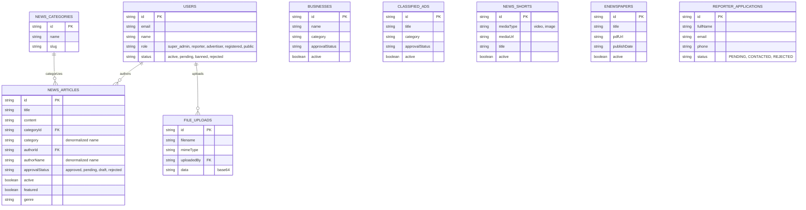

# StarNews Project Progress - September 1st Session

## Executive Summary
In our extensive audit and debugging session on September 1st, we performed a deep-dive security, architecture, and bug-fixing sprint on the StarNews Next.js/Firebase application. We successfully resolved **26 code-level bugs** spanning authentication, authorization, database performance, and UI/UX flows. The codebase is now highly secure, stable, and ready for production deployment (pending a few manual infrastructure setups).

## Key Accomplishments

### 1. Security & Authentication
- **Blocked XSS Attack Vectors:** Removed SVG support from file uploads and added strict MIME type validation using magic bytes.
- **Secured API Endpoints:** Added authentication checks to the previously public `/api/file/[id]` endpoint.
- **Sanitized Data Exposure:** Modified `/api/auth/me` to return only a whitelist of safe fields, preventing raw Firestore document exposure.
- **Hardened Configuration:** Removed `unsafe-eval` from Content-Security-Policy (CSP) and fixed wildcard CORS defaults.
- **Fixed Authentication Flows:**
  - Repaired `create-admin.js` which was failing due to incorrect environment variable mapping.
  - Fixed a critical bug in `change-password` where unusable custom tokens were being issued and stored.
  - Improved UI feedback for silent session expirations.

### 2. Database & API Performance
- **Free-Tier Compatibility (P1-DB-01):** Replaced Firestore `count()` API calls (which fail on the Spark/free plan) with `select().get().size` across multiple endpoints (`admin/news`, `admin/stats`).
- **Query Optimization:** Bounded previously unbounded queries (e.g., admin news fetching) with sensible limits (max 500) to prevent memory crashes.
- **Dead Code Elimination:** Removed stubs for non-existent routes (`liveTV.update`, `ads`, `classifieds.submit`).

### 3. Business Logic & Role Management
- **Ticker Integrity:** Fixed the breaking ticker logic so it properly displays active news. Also prevented Reporters from bypassing Admin approval when submitting to the live ticker.
- **Unified Approvals:** Upgraded the user approval endpoint to properly handle 'approve', 'reject', and 'ban' states.
- **Shared Constants:** Extracted `ROLES` to a client-safe shared module (`lib/roles.js`) to prevent drift and build errors.

### 4. Logging & Configuration
- **Restored Error Visibility:** Uncommented silenced `console.error` logs across 8 admin and reporter API routes, making backend debugging possible.
- **Deployment Fixes:** Removed `output: 'standalone'` from `next.config.js` to ensure compatibility with Vercel's native deployment architecture.

## Remaining Manual Steps for Delivery
To reach 100% production readiness, the following manual steps are required:
1. **Rotate Firebase Credentials:** Generate a new private key in Firebase Console and update `.env.local`.
2. **Seed Admin Account:** Run `npm run create-admin`.
3. **Configure Firestore Indexes:** Click the auto-generation links in the console for any required composite indexes.
4. **Set Up Firebase Storage:** Required for PDF E-Newspaper uploads on Vercel.

---

## Entity-Relationship (ER) Diagram
*Note: StarNews uses Firebase Firestore (NoSQL), so relationships are mostly managed via denormalization (e.g., storing `authorName` directly in `NEWS_ARTICLES` alongside `authorId`) rather than strict SQL foreign keys.*

